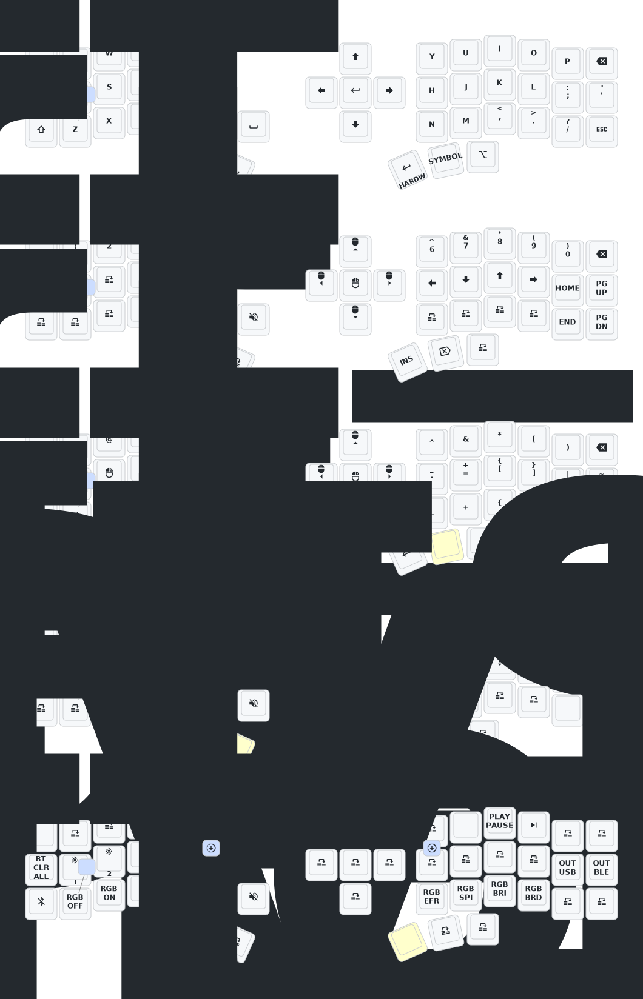

This is just fork of [PandaKB eyelash corne config](https://github.com/PandaKBLab/corne-j-keyboard-zmk) for changing keymap and tweaks.

## Useful links

- [Keymap editor](https://nickcoutsos.github.io/keymap-editor/)
- [Video-guide about ZMK keymap editing and flashing](https://www.youtube.com/watch?v=XtOQRHpXnj4) for dummies
- [Insights from Reddit](https://www.reddit.com/r/ErgoMechKeyboards/comments/1ju67yx/aliexpress_eyelash_corne_basic_beginner_guide/) could be helpful if you still frustrate

## Keymap Diagram

